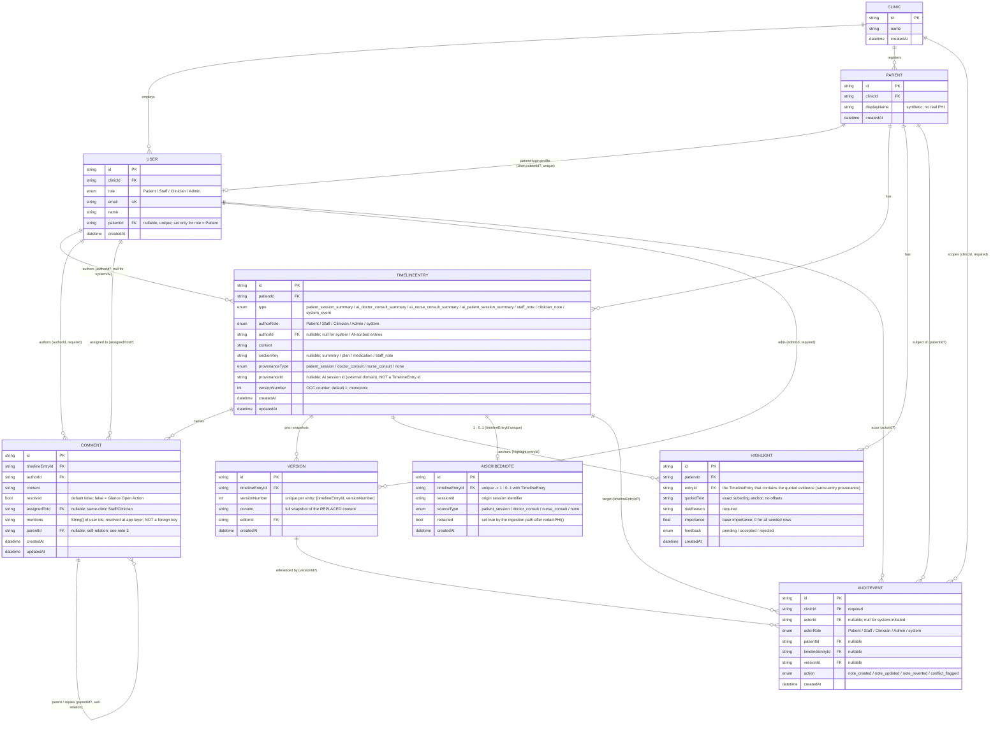

# Nightingale — Final Data Schema / Relationships (Diagram 2)

**Architecture commit (application code):** `7aa5129d13958dc27174c7da0c42c4187048925b`
**Evidence basis:** derived directly from `prisma/schema.prisma` at the commit above. Field lists are
trimmed to what is useful for understanding the architecture; every entity and relation shown exists
in the schema.

## Legend

| Notation | Meaning |
|---|---|
| `1` (`\|\|`) | exactly one |
| `0..1` (`o\|`) | zero or one |
| `*` (`o{`) | zero or many |
| Solid relation | a persisted Prisma relation (foreign key) |
| Notes below the diagram | non-persisted runtime logic (not entities) |
| `PK` / `FK` / `UK` | primary key / foreign key / unique key |

## Caption

This schema is taken directly from the final `prisma/schema.prisma` at commit
`7aa5129d13958dc27174c7da0c42c4187048925b`. There is **no standalone Provenance entity**. There is
**no persisted adaptive-learning model**. `Comment.parentId` exists in the data model and API, but
the delivered UI does not render threaded replies. `Version.content` (full historical snapshots) and
`AuditEvent` (mutation metadata) serve different roles and are kept separate.

## Schema truth notes

1. **No Provenance table.** AI-session provenance is stored on `TimelineEntry` as
   `provenanceType` + `provenanceId` (an external session id, never a `TimelineEntry` id).
   Highlight provenance is anchored by `Highlight.entryId` (to the *same* entry that holds the
   evidence) plus `Highlight.quotedText` located by exact substring match at read time. There is no
   `sourceEntryId` and no cross-entry provenance relation.

2. **Adaptive priority is derived, not persisted.** `Highlight.feedback` and `Highlight.importance`
   are the only stored inputs. Feedback aggregation, normalized-`riskReason` bucketing, the
   deterministic lexical-overlap fallback, `learnedAdjustment` / `effectiveImportance`, the
   `learningStatus`, and the `classifyRiskFloor` critical/unrated tag are all computed at read time
   in `GET /api/patients/:id/highlights`. No `FeedbackEvent`, `LearningModel`, `Embedding`,
   `Pattern`, `AdaptivePriority`, or `RiskFloor` entity exists.

3. **`Comment` self-relation is a stored capability, not a delivered UX.**
   `Comment.parentId` (`CommentThread` self-relation: `parent` / `replies`) is present in the schema
   and accepted/validated by `POST /api/timeline/:id/comments`, but `CommentsSection` renders a
   **flat** list grouped only into Open / Resolved — no nesting, no reply composer. There is no
   notification delivery for `mentions` or `assignedToId`.

4. **Raw AI input is not persisted.** `AiScribedNote` stores `sessionId`, `sourceType`, and a
   `redacted` flag; the raw transcript submitted to `POST /api/patients/:id/ai-scribe` is passed
   through `redactPHI()` to the local `MockLlmAdapter` and is never written to any table or log.
   `AiScribedNote` has no relation to any external LLM provider and no transcript table exists.

5. **`Version` vs `AuditEvent`.** `Version` answers *"what did the content previously contain?"* —
   it is a full snapshot of the content that was **replaced** by an edit or revert, created only
   after a successful optimistic-concurrency claim (`@@unique([timelineEntryId, versionNumber])`).
   `AuditEvent` answers *"who performed which mutation-related action?"* — metadata only, no content.

6. **`TimelineEntry.versionNumber`** is the optimistic-concurrency counter (default `1`, monotonic).
   A revert advances it forward; it is never rewound. The current live content lives on
   `TimelineEntry`; `Version` holds only superseded snapshots.

7. **`mentions`** is a scalar `String[]` of user ids (`String[]` in Postgres), resolved to display
   names at the application layer via `GET /api/collaborators`. It is **not** a foreign-key relation.

## Entities NOT present in this schema (must not be added to the diagram)

`Provenance`, `FeedbackEvent`, `FeedbackHistory`, `LearningModel`, `Embedding`, `Pattern`,
`AdaptivePriority`, `RiskFloor`, `Notification`, `Allergy`, `Medication`, `ChiefComplaint`,
`Transcript`, `VoiceCapture`, `Session` (as a table), and any external-LLM-provider entity.
