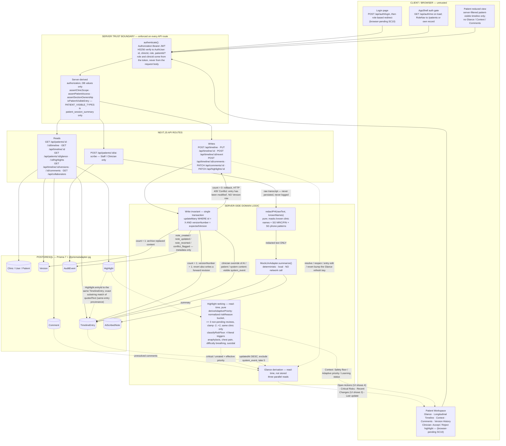

# Nightingale — System Architecture / Data Flow (Diagram 1)

**Architecture commit (application code):** `7aa5129d13958dc27174c7da0c42c4187048925b`
**Evidence basis:** `prisma/schema.prisma`, the Next.js API routes under `src/app/api/**`, the
authorization libraries under `src/lib/auth/**`, and the domain logic under `src/lib/**`, at the
commit above. UI files were read only to identify user-triggered entry points.

## Architecture evidence boundary

This diagram is derived from the final Prisma schema, API routes, authorization guards, and
implementation code at the recorded application commit. It represents **implemented components,
persisted relationships, and code-level data flows**. It does **not**, by itself, assert that every
illustrated user-triggered interaction has been independently browser-verified end to end.
Browser-dependent interaction paths are verified separately during **SC10 Demo Rehearsal**, before
SC11 recording. Nodes/edges that depend on unobserved browser interaction are tagged
`browser-pending SC10`.

## Legend

| Notation | Meaning |
|---|---|
| Solid arrow `-->` | Implemented request path or persisted write/read |
| Dashed arrow `-.->` | Derived / read-time computation (nothing persisted) |
| Subgraph box | A layer or an authorization / security boundary |
| `browser-pending SC10` | Code path exists and is route/library-verified; the user-triggered browser interaction has **not** yet been independently confirmed |

## Caption

Server-side RBAC is authoritative: `authenticate()` verifies an HS256 Bearer JWT and every route
re-derives `clinicId`, patient identity, and section ownership from the database, never from the
request body; frontend visibility is convenience only. Glance and adaptive-priority values are
**derived at read time** and are never persisted. `MockLlmAdapter` is local and deterministic and
makes no network call. In the AI Scribe path, `redactPHI()` runs **before** the adapter and the raw
transcript is never persisted or logged. Writes use an optimistic-concurrency invariant: a stale
`expectedVersion` is rejected with HTTP 409 and leaves no `Version` row. Browser-dependent
interactions (login/patient redirects, Recent Changes and Open Actions click-through, selected-entry
to Context sync, comment add/mention/assign/resolve/reopen, version diff and revert, adaptive
Accept/Reject and the recalculation message, and the Patient-safe rendered view) are code-verified
only and are confirmed in **SC10**.

## Flow notes (per-boundary, evidence-tagged)

### Client / UI layer
Real final surfaces only: Login, `AppShell` (auth gate + `RoleNav`), the Patient Workspace
(`Glance`, `Timeline`, `ContextPanel`, `CommentsSection`, `VersionHistory`, and Clinician-only
highlight Accept/Reject), and the Patient reduced view. There is **no** real-time sync, **no**
notifications, **no** Patient AI chat, and **no** generic Admin console. *(UI-ENTRY-POINT-VERIFIED;
interaction paths BROWSER-PENDING-SC10.)*

### Auth / security boundary
`Authorization: Bearer <JWT>` → `authenticate()` (HS256-only verify; `JWT_SECRET` from env) →
`AuthUser { id, clinicId, role, patientId? }`. Then DB-derived checks: `assertClinicScope`
(all roles including Admin), `assertPatientAccess` (adds the Patient own-record check),
`assertSectionOwnership` (`staff_note`→Staff; `plan`/`summary`/`medication`→Clinician; fail-closed),
`isPatientVisibleEntry`. *(LIBRARY-VERIFIED, ROUTE-VERIFIED, TEST-SUPPORTED — `test_rbac_scope.py`.)*

### Patient visibility boundary
`PATIENT_VISIBLE_TYPES = { patient_session_summary }` — the only entry type a Patient can read.
Patient is denied Glance / highlights / comments / collaborators (403 **before** any DB access) and
internal single-entry reads return **404** to hide existence. Describe this as the
*server-filtered patient-visible surface*, not "safe patient data". *(ROUTE-VERIFIED, LIBRARY-VERIFIED,
TEST-SUPPORTED — `test_rbac_scope.py`, `test_provenance_source.py`.)*

### Glance derivation (derived, not stored)
`GET /api/patients/:id/glance` → auth + clinic scope → three parallel reads:
1. `Comment` where `resolved = false` for the patient → **Open Actions** (route returns all; **UI displays up to 4**, plus a "+N more" note).
2. `Highlight` rows → `classifyRiskFloor()` → **Critical Risks** (only `riskFloor = "critical"`).
3. `TimelineEntry` `updatedAt` DESC, `type != system_event`, **`take: 5`** → **Recent Changes** (**UI displays 3**).
"Last update" = the newest `recentChanges.updatedAt`. **There is no Glance table or model.**
The critical risk floor uses exactly `anaphylaxis`, `chest pain`, `difficulty breathing`, `suicidal`
— a *deterministic trigger-based safety floor, not a comprehensive clinical risk assessment*.
*(ROUTE-VERIFIED, LIBRARY-VERIFIED, TEST-SUPPORTED — `test_glance_refresh.py`, `test_timeline_chronology.py`.)*

### Comments / collaboration
`TimelineEntry` → `Comment` (`content`, `mentions[]`, `assignedToId`, `resolved`, `parentId?`).
`mentions` / `assignedToId` are validated to reference **same-clinic Staff/Clinician** users
(`GET /api/collaborators` supplies the picker). `resolved = false` comments feed Glance Open Actions.
`Comment.parentId` exists in the schema and the API stores it, **but the rendered UI is flat
entry-level** — no threaded reply tree, no reply composer, and **no notification delivery**.
*(SCHEMA-VERIFIED, ROUTE-VERIFIED, TEST-SUPPORTED — `test_comment_collaboration.py`; rendering
BROWSER-PENDING-SC10.)*

### AI Scribe
`Staff / Clinician` → `POST /api/patients/:id/ai-scribe` → `authenticate` + `assertPatientAccess`
→ collect `knownNames` (target patient + same-clinic user names) **after** authorization →
`redactPHI(rawText, knownNames)` → `MockLlmAdapter.summarize(redactedText, sessionType)` →
transaction: `TimelineEntry` (`authorRole = system`, `authorId = null`, `sectionKey = "summary"`,
`provenanceType`, `provenanceId = sessionId`) + `AiScribedNote` (`timelineEntryId`, `sessionId`,
`sourceType`, `redacted = true`) + `AuditEvent` (`note_created`).
Session-type → entry-type map: `doctor_consult → ai_doctor_consult_summary`,
`nurse_consult → ai_nurse_consult_summary`, `patient_session → ai_patient_session_summary`.
`MockLlmAdapter` is deterministic and local; **no external LLM, no network call, no Patient live AI
session**. Provenance identifies the **source session**, not factual/clinical correctness.
*(ROUTE-VERIFIED, LIBRARY-VERIFIED, SCHEMA-VERIFIED, TEST-SUPPORTED — `test_ai_scribe_ingestion.py`.)*

### Highlight provenance (same-entry)
`Highlight.entryId` → **the same** `TimelineEntry`. `GET /api/patients/:id/highlights` loads that
entry's `content` and does an exact, case-sensitive substring search for `quotedText`
(`quotedTextFound`, `occurrenceCount`); `ContextPanel` renders `locateQuote()` with the matched span
marked. There is **no** separate source entry, **no** `sourceEntryId`, **no** offset storage, and
**no** cross-entry citation. "Exact quote located" = the text was found in the entry's current stored
content — **not** clinical validation. *(SCHEMA-VERIFIED, ROUTE-VERIFIED, LIBRARY-VERIFIED,
TEST-SUPPORTED — `test_highlight_provenance.py`, `test_provenance_source.py`, `locate-quote.test.ts`.)*

### Adaptive prioritization (deterministic, read-time)
`Highlight.feedback` (Accept/Reject, Clinician-only `PATCH /api/highlights/:id`) →
same-clinic + normalized-`riskReason` bucket (exact string match first, deterministic
lexical-overlap fallback second) → `accepted` / `rejected` counts (`pending` excluded) →
threshold `>= 3` non-pending reviews → `learnedAdjustment = clamp(accepted - rejected, -2, +2)` →
`effectiveImportance = baseImportance + learnedAdjustment` (base is `Highlight.importance`, `0` for
all seeded rows). A **separate** deterministic path: `quotedText + riskReason` →
`classifyRiskFloor()` → `critical` / `unrated`. Final ordering: **safety floor → effective priority
→ createdAt → id**; the safety floor is independent and authoritative and feedback can never cross
it. **No** vector DB, embeddings, ML model, model training, feedback-history store, recency
weighting, or clinical-entity tagging. Term: *deterministic feedback-informed adaptive
prioritization*. *(LIBRARY-VERIFIED, ROUTE-VERIFIED, TEST-SUPPORTED —
`test_adaptive_highlight_priority.py`, `derive-adaptive-priority.test.ts`,
`lexical-grouping.test.ts`, `order-adaptive-highlights.test.ts`, `classify-risk.test.ts`.)*

### Version / OCC / revert
**Edit:** client sends `expectedVersion` → `PUT /api/timeline/:id` → auth + section ownership →
transaction → `updateMany WHERE id = X AND versionNumber = expectedVersion`.
`count = 0` → rollback, **HTTP 409** `"Conflict: entry has been modified"`, **no Version row**,
content unchanged, best-effort `conflict_flagged` audit (`versionId = null`).
`count = 1` → replaced content archived as a `Version`, `TimelineEntry.versionNumber + 1`,
`note_updated` audit. Clinician override of AI / patient / system-authored content also writes a
`conflict_flagged` audit **and** a visible `system_event`.
**Revert:** `POST /api/timeline/:id/revert` → archive current live content as a new `Version` →
set the chosen historical content → `versionNumber` advances **forward** (never rewound) →
`note_reverted` audit → visible `system_event`. **No** auto-merge, CRDT, overwrite-anyway, or
version-number reset. *(ROUTE-VERIFIED, SCHEMA-VERIFIED, TEST-SUPPORTED —
`test_concurrent_edits.py`, `test_revision_history.py`, `test_conflict_override.py`,
`test_version_diff.py`, `word-diff.test.ts`.)*

### Audit
`AuditEvent` is **metadata only**: `actorId?`, `actorRole`, `clinicId`, `patientId?`,
`timelineEntryId?`, `versionId?`, `action` ∈ { `note_created`, `note_updated`, `note_reverted`,
`conflict_flagged` }, `createdAt`. **No** raw note content, AI prompt, or redacted text is stored.
RBAC-denial logging is out of scope. *(SCHEMA-VERIFIED, ROUTE-VERIFIED, TEST-SUPPORTED —
`test_revision_history.py`, `test_conflict_override.py`.)*

## SC6-PROHIBITED / NOT-IMPLEMENTED elements (must not be read as implemented architecture)

Notification / alert / inbox service; rendered threaded-comment hierarchy; external production LLM
(OpenAI / Anthropic / Claude API); embeddings / vector database / semantic index; feedback-history
or feedback-event log; model-training pipeline; Patient live AI chat or Patient-triggered ingestion
UI; WebSocket / event bus / real-time sync; production encryption or compliance service;
cross-entry provenance relation / `sourceEntryId`; generic Admin CRUD; structured Allergy /
Medication / ChiefComplaint models or clinical-entity tagging; recency-weighted self-learning;
temporal data-decay implementation; voice capture / speech transcription / diarization;
`GET /api/patients` list service; `GET /api/timeline/:id/changes?since=`; auto-merge / CRDT engine.

## SC10 reopen dependency

If SC10 browser behavior materially contradicts an interaction path in this diagram: determine
whether the discrepancy is UI-only. If UI-only, do **not** redraw the schema. If it changes an
actually-implemented data flow, reopen **only** the affected annotation/arrow here, plus the
matching SC4.F truth-boundary verdict and SC5 claim-evidence row; do not invalidate unrelated
architecture. SC11 recording cannot proceed until the discrepancy is reconciled.
