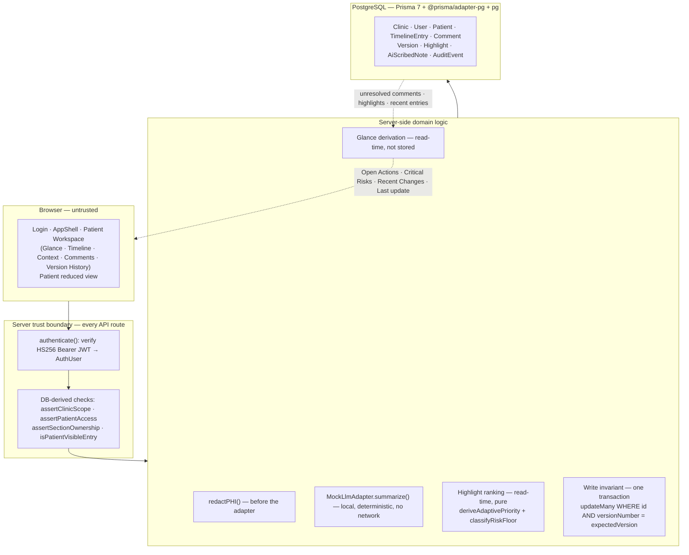
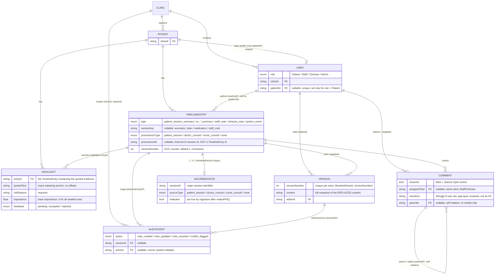

# Nightingale — Technical Brief

Nightingale is a synthetic-data prototype of a collaborative, longitudinal
patient-note clinic. This brief explains why the system is built the way it is,
which engineering trade-offs were made, and what evidence supports the design.
Setup and exploration instructions are in `README.md`.

## 1. Problem Framing & Design Goals

A shared longitudinal record is only useful if three properties hold together,
so the design is organised around them:

1. **Access correctness.** Records cross roles and clinics, so authorization must
   be a server-side property of every request — derived from authenticated
   identity and database relationships, never from a role or id in the request
   body or from UI state.
2. **Change integrity and traceability.** Concurrent clinical edits must not
   silently overwrite each other. Content history, the action trail, and the
   origin of a highlighted phrase should each be reconstructable afterwards.
3. **Fast clinician orientation.** Opening a record should surface current
   unresolved actions, critical flags, and recent changes without re-reading the
   whole Timeline.

**Prototype boundary.** All data is synthetic. This is not a production clinical
system: no medical judgement, and no compliance, encryption-at-rest, or
deployment claim.

## 2. System Architecture

Next.js (App Router) serves the UI and the JSON API under `src/app/api/**`. Every
API route verifies an HS256 bearer token, resolves an `AuthUser`
(`id`, `clinicId`, `role`, optional `patientId`) from the token claims, then
re-derives clinic scope, patient access, and section ownership from database
values. Domain logic — PHI redaction, the mock summarizer, Glance derivation,
adaptive ranking, and the optimistic-concurrency write path — sits behind that
boundary. Prisma 7 with the `@prisma/adapter-pg` driver adapter and the `pg`
driver persists to PostgreSQL; the reference environment hosts PostgreSQL on Neon.



**Server-side authorization.** Client-side role visibility is a UX convenience
only. The authorization boundary is the API route: it trusts the signed token for
identity and the database for every relationship (`clinicId`, patient ownership,
`sectionKey` ownership), so a crafted request body or stale UI state cannot act
as an access decision. This is a prototype boundary, not a claim of production
IAM maturity.

**Derived Glance.** Glance is not stored. `GET /api/patients/:id/glance` computes
it per request from three parallel reads — unresolved `Comment` rows (Open
Actions), `Highlight` rows classified by the risk floor (Critical Risks), and the
most recent non-`system_event` `TimelineEntry` rows (Recent Changes). For
prototype scale this avoids a second mutable summary store that could drift from
the longitudinal record; the trade-off is read-time computation, which is
appropriate at the submitted prototype scale.

**AI Scribe redaction boundary.** Raw session text flows `auth/scope →
redactPHI() → MockLlmAdapter → persisted TimelineEntry + AiScribedNote +
AuditEvent`. Redaction runs *before* the summarization adapter; the raw
transcript is never persisted or logged.

## 3. Data Model & Integrity

Nine persisted entities. There is **no** standalone `Provenance` table, **no**
persisted adaptive-priority model, and **no** rendered threaded-comment tree:
provenance and adaptive ranking are fields plus read-time derivation.



**3.1 TimelineEntry as the longitudinal core.** One chronological per-patient
stream carries patient session summaries, the three AI-scribed consult summary
types, staff notes, clinician notes, and system events, which is what makes a
"what changed over time" reading possible. `sectionKey` matters only for write
authorization: `staff_note → Staff`; `plan` / `summary` / `medication →
Clinician`; a `null` or unknown section fails closed for every role.

**3.2 Optimistic Concurrency Control.** Every content write carries an
`expectedVersion` and is a single conditional update:

```
updateMany WHERE id = X AND versionNumber = expectedVersion
  matched 1 → archive replaced content as a Version, versionNumber += 1, note_updated audit
  matched 0 → rollback; HTTP 409 "Conflict: entry has been modified"; NO Version row; content unchanged
```

This is stale-write **rejection**, not a merge: no auto-merge, CRDT, or
three-way resolution. A rejected stale write never becomes content history — it
leaves only a best-effort `conflict_flagged` audit row.

**3.3 Version vs AuditEvent.** The OCC rule forces a clean split. `Version`
answers *"what did the content previously contain?"* — a full snapshot of
replaced content, written only after a successful concurrency claim
(`@@unique([timelineEntryId, versionNumber])`). `AuditEvent` answers *"who
performed which mutation action?"* — metadata only (actor, role, clinic, target
ids, `action`, timestamp); it never stores note content, raw transcript, prompt
text, or redacted text. A conflict can be worth auditing while the rejected write
must stay out of content history, so the two concepts are different tables.

**3.4 Forward-only revert.** Revert reads an older `Version` as its source but
writes a **new forward revision**: the current live content is archived as a
`Version`, the chosen historical content becomes live, `versionNumber` advances
(never rewound), and a visible `system_event` is emitted. History stays monotonic
and auditable; the trade-off is that revisions accumulate forward rather than the
database being rolled back.

**3.5 Same-entry provenance.** A `Highlight` points to one `TimelineEntry` via
`entryId`, and its `quotedText` must occur as an exact substring of that entry's
*current* content at read time. That supports an "exact quote located"
affordance and nothing stronger: no `sourceEntryId`, no cross-entry evidence
graph, no stored offsets. Provenance shows where the highlighted text originated
within the current `TimelineEntry`; it does not validate the underlying clinical
claim. AI-session provenance is carried the same way, as `provenanceType` /
`provenanceId` fields on the entry (an external session id, not a `TimelineEntry`
id).

## 4. Intelligent Behaviors: Ingestion & Prioritization

### 4.1 AI Scribe — Core

```
session text
  → authentication + clinic-scope check
  → redactPHI(rawText, knownNames)          # runs BEFORE the adapter
  → MockLlmAdapter.summarize(redactedText)  # local, deterministic, no network
  → transaction: TimelineEntry (authorRole = system) + AiScribedNote + AuditEvent
```

Supported session types — `doctor_consult`, `nurse_consult`, `patient_session` —
each map to their own AI summary entry type and provenance type. **Real** in the
prototype: authentication, clinic scope, the PHI-redaction path, timeline and
`AiScribedNote` persistence, provenance, and audit. **Mocked:** the summarization
step only — `MockLlmAdapter` returns a deterministic function of its redacted
input.

**External LLM runtime: NOT USED.** No OpenAI, Anthropic/Claude, or other hosted
model API is invoked, and no model API key is required. The raw transcript is
neither persisted nor logged. The prototype implements the ingestion, redaction,
provenance, and persistence boundaries; only the summarization inference layer is
mocked. The adapter is not a trained model and performs no semantic or clinical
reasoning.

### 4.2 Adaptive Highlight Prioritization — Bonus

A **bonus** capability. Given the small feedback volume available in a prototype,
a deterministic, auditable adjustment was preferred over fitting a trained model.
Clinician review sets each highlight's `feedback` to `pending` / `accepted` /
`rejected`. At read time, `GET /api/patients/:id/highlights` groups highlights
**within the same clinic** by normalized `riskReason` — exact normalized match
first, then a deterministic lexical fallback (shared non-stop-token count ≥ 2
**and** Jaccard ≥ 0.60). Per bucket:

- `reviewCount = accepted + rejected` (`pending` never counts);
- fewer than **3** reviews → `learnedAdjustment = 0`;
- otherwise `learnedAdjustment = clamp(accepted − rejected, −2, +2)`;
- `effectiveImportance = baseImportance + learnedAdjustment` (base is
  `Highlight.importance`, `0` for every seeded row).

`learnedAdjustment` is the implementation field; the mechanism is deterministic
feedback aggregation, not machine learning — no embeddings, semantic similarity,
feedback-history store, or recency weighting.

**Safety floor (independent of feedback).** `classifyRiskFloor()` does a
lowercase literal-substring check over a highlight's `quotedText` + `riskReason`
for exactly four phrases: **anaphylaxis · chest pain · difficulty breathing ·
suicidal**. A match makes the highlight `critical`, and critical highlights sort
ahead of all others regardless of feedback (final order: safety floor → effective
priority → `createdAt` → `id`); a learned adjustment can never cross the floor.
This trigger-based floor is not a comprehensive clinical risk assessment — not an
NLP safety classifier, and no medication, allergy, or triage inference.

## 5. Engineering Evidence

**Performance — approximation method:** authenticated `GET
/api/patients/:id/glance` requests were issued against a production `next start`
build (Next.js 16.3.3), Clinician role, canonical synthetic dataset, on
application commit `7aa5129d13958dc27174c7da0c42c4187048925b`. 10 warm-up
requests were discarded; 40 warm requests measured; percentiles by nearest-rank
(`rank = ceil(p × N)`). Result: **P50 = 23.01 ms, P95 = 34.23 ms** against the
Candidate Brief's ≤ 300 ms warm-path target — **PASS**. This is authenticated
server endpoint response latency, not full browser rendering or user-perceived
page latency; browser/render latency was not measured. Method and raw samples:
`docs/performance-evidence.md`.

**Validation.** Behaviour was checked with targeted Python regression tests and
co-located TypeScript unit tests, route/security checks, a repository-level
evidence audit, and user-performed manual browser verification of the interaction
paths. The required Core micro-tests are present — `test_rbac_scope.py`,
`test_revision_history.py`, `test_highlight_provenance.py`,
`test_concurrent_edits.py` — with further tests covering AI Scribe ingestion,
collaboration, conflict override, glance, provenance, chronology, version diff,
and adaptive priority. This was not test-driven development, and there is no
independent automated end-to-end browser suite.

## 6. Assumptions, Trade-offs & Scope Boundaries

| Decision | Rationale | Trade-off |
|---|---|---|
| Derived Glance | Avoids a second mutable summary store that could drift from the record | Read-time computation on each request |
| Flat comments | Simpler, reliable collaboration surface at prototype scale | `parentId` exists in schema/API, but nesting and a reply UI are not rendered |
| Same-entry provenance | Deterministic quote-level traceability without another source graph | No cross-entry evidence graph / `sourceEntryId` |
| Deterministic adaptive logic | Auditable with the low feedback volume available | Not semantic ML; no recency or feedback-history model |
| Local `MockLlmAdapter` | Exercises auth / redaction / persistence / provenance boundaries without an external model dependency | No production summarization inference |
| Forward-only revert | Preserves monotonic, auditable history | Revisions accumulate instead of the database being rewound |

**Core partial-scope limitations.** Collaboration UI is flat entry-level rather
than nested threaded comments; provenance is same-entry only; mentions and
assignments do not generate notifications; quote matching uses exact current-text
search rather than persisted offsets; AI Scribe summarization is mocked; PHI
redaction is heuristic and Singapore-oriented, not medical-grade NER; demo
authentication is passwordless; the JWT session model has no per-request
revocation or revalidation beyond the token claims.

**Bonus scope.** Adaptive highlight prioritization is implemented as the
deterministic feedback-informed mechanism above. Hybrid storage / data decay is
architectural discussion only (below) — no implementation exists in the submitted
code. Voice / ambient consult capture is not implemented. Structured clinical
entity tagging (allergy, medication, chief complaint) is not implemented. These
are bonus / non-goal boundaries, not Core Glance gaps.

**Proposed production extension — not implemented.** At production scale, older
immutable Timeline content could be tiered to lower-cost storage while searchable
metadata and clinically relevant summaries stay in the primary store, with a
tiering policy weighting recency, active-care relevance, unresolved actions, and
risk relevance. None of this exists in the submission: no tiering, decay
scheduler, object store, TTL, or automatic summarization/deletion.

**Prototype and security assumptions.** Synthetic data only; passwordless demo
login; prototype-grade JWT sessions with no per-request revocation; no production
compliance claim; no encryption-at-rest implementation claim; no clinical safety
certification.

**Dependencies.** `npm audit` identified pre-existing findings in the Prisma /
devDependency chain; dependency versions were not changed during this submission
cycle. Development used a structured prompt-driven workflow with Claude; runtime
AI remains the local deterministic `MockLlmAdapter` described above. Third-party
libraries and licenses are listed in `ATTRIBUTION.txt`.

## Closing statement

The prototype prioritises traceability, explicit server-side authorization
boundaries, and deterministic, auditable behaviour over feature breadth. Core
capabilities — the longitudinal Timeline, derived Glance, collaboration, revision
integrity, provenance, and AI Scribe — are represented at the implemented scope
described above. Items beyond the implemented adaptive-priority mechanism are
identified explicitly as architectural-only or not implemented, rather than
presented as delivered functionality.
